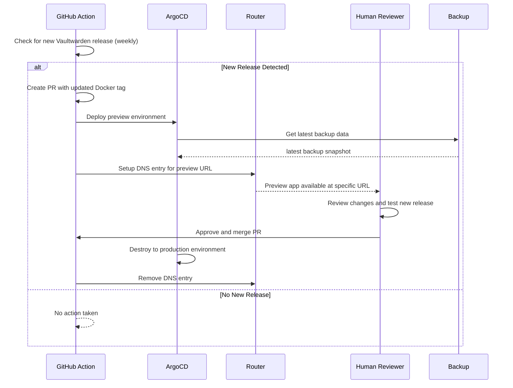

# vaultwarden

## TODO

- add longhorn-volumes as k8s manifests
- add longhorn recurring tasks for snapshot an backup
- backup-cronjob inhertitance

## Prerequisites

- [External Secrets Operator](https://external-secrets.io/latest/) is installed

- [Vault](https://www.vaultproject.io/) is installed and configured

- Create Vaultwarden kubernetes role Vault

      vault write auth/kubernetes/role/vaultwarden \
          bound_service_account_names=vaultwarden-vault-sa \
          bound_service_account_namespaces=vaultwarden \
          policies=vaultwarden \
          ttl=24h

- Create Vaultwarden policy in Vault ([vaultwarden-policy.hcl](/applications/vaultwarden/overlays/production/vaultwarden-policy.hcl))
    
      vault policy write vaultwarden vaultwarden-policy.hcl

## Install

    # Argo CD Application
    kubectl apply -f https://raw.githubusercontent.com/tryrocket-cloud/tryrocket-cloud/main/applications/vaultwarden/overlays/production/application.yaml -n argocd

    # Argo CD Preview Application
    kubectl apply -f https://raw.githubusercontent.com/tryrocket-cloud/tryrocket-cloud/main/applications/vaultwarden/overlays/preview/application-set.yaml -n argocd

## Update

## Snapshots & Backup 

[General information about backups](https://github.com/tryrocket-cloud/tryrocket-cloud/wiki/Backup)

  - [Vaultwarden Data Volume](../../infrastructure/longhorn/test-volume.yaml) 
  - [Postgres Data Volume](../../infrastructure/longhorn/test-volume.yaml)

  [#74](https://github.com/tryrocket-cloud/tryrocket-cloud/issues/74)

- Longhorn Volumes Snapshots

       `0 0,12 * * *`

- Longhorn Volumes Backups 
  
      `15 0 * * 0`

- Raw data

    [CronJob]((./overlays/production/backup/backup-cronjob.yaml))

## Vaultwarden in HA mode (currently not possible)

- https://vaultwarden.discourse.group/t/running-highly-available-vaultwarden/3285

