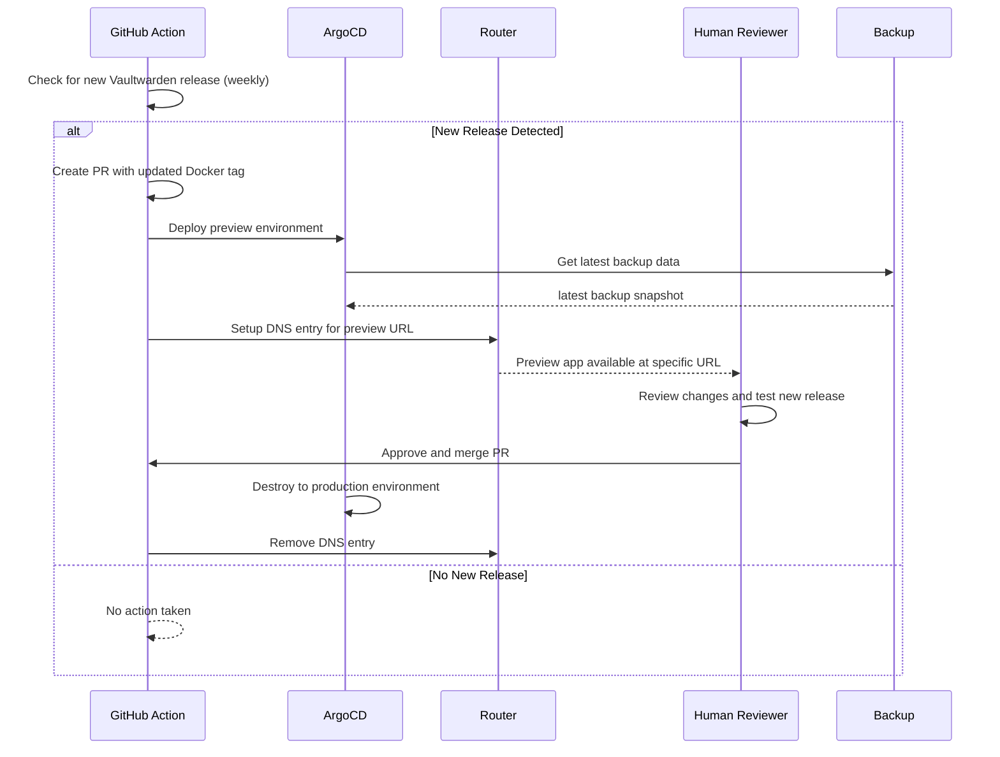

# vaultwarden

## Datasheet

- replica 
- where is the backup
- how many backups
- where is the doc how to restore

## todo
- create database for vaultwarden

- install github runner
- run action to stop vw
- run action to snapshot volumes
  - vaultwarden
  - postgres
- run action to backup volumes
- run action to backup data
- run action to sync vw app

## Prerequisites

### Production

- create longhorn volume for postgres
- create longhorn volume for vaultwarden
- create a superuser password in vault for postgres database

- create database user
- create a new database with this new user and matching the creds in deployment

## Install

    # Argo CD Application
    kubectl apply -f https://raw.githubusercontent.com/tryrocket-cloud/tryrocket-cloud/main/applications/vaultwarden/overlays/production/application.yaml -n argocd

    # Argo CD Preview Application
    kubectl apply -f https://raw.githubusercontent.com/tryrocket-cloud/tryrocket-cloud/main/applications/vaultwarden/overlays/preview/application-set.yaml -n argocd

## Update

## Backup

[General information about backups](https://github.com/tryrocket-cloud/tryrocket-cloud/wiki/Backup)

### Configuration:

- [CronJob](./overlays/production/backup/backup-cronjob.yaml)

## Vaultwarden in HA mode (currently not possible)

- https://vaultwarden.discourse.group/t/running-highly-available-vaultwarden/3285

