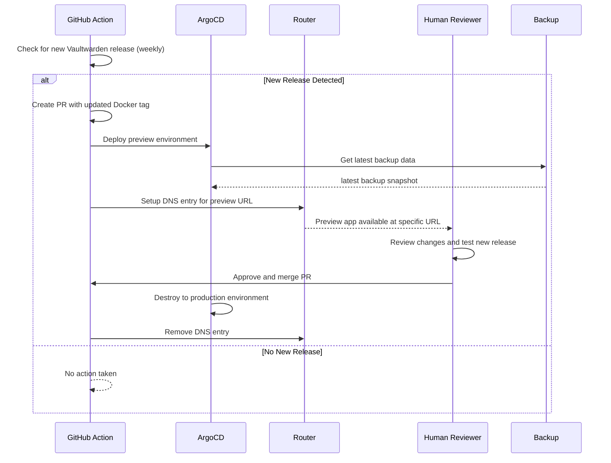

# vaultwarden

## Datasheet

- replica 
- where is the backup
- how many backups
- where is the doc how to restore

## todo
- create database for vaultwarden

- install github runner
- run action to stop vw
- run action to snapshot volumes
  - vaultwarden
  - postgres
- run action to backup volumes
- run action to backup data
- run action to sync vw app

## Prerequisites

### Production

- create database user
- create a new database with this new user and matching the creds in deployment

### Staging

no prerequisites needed

### Testing

no prerequisites needed

## Install 

    just app-deploy vaultwarden production

## Update

## Backup

https://github.com/tryrocket-cloud/tryrocket-cloud/wiki/Backup

### Restic

### 1. Automated Backup (`tryrocket.cloud`)

The automated backup process is configured to run regularly in a k3s cluster. This process ensures that critical data is backed up at `0 3 * * *` (*at 03:00 o'clock*) without requiring any manual intervention.

#### Configuration:

- [CronJob](./overlays/production/backup/backup-cronjob.yaml)

### 2. On-Demand Backup (Local)

In addition to the automated backup, this project also supports on-demand backups that can be triggered locally. This is useful when you need to create a backup at a specific point in time, outside the regular schedule.

#### Example Command:

To run an on-demand backup locally, use the following command:

    restic backup /path/to/data --tags on-demand --tags vaultwarden:$VAULTWARDEN_VERSION

https://github.com/tryrocket-cloud/tryrocket-cloud/issues/48

## Vaultwarden in HA mode (currently not possible)

- https://vaultwarden.discourse.group/t/running-highly-available-vaultwarden/3285

